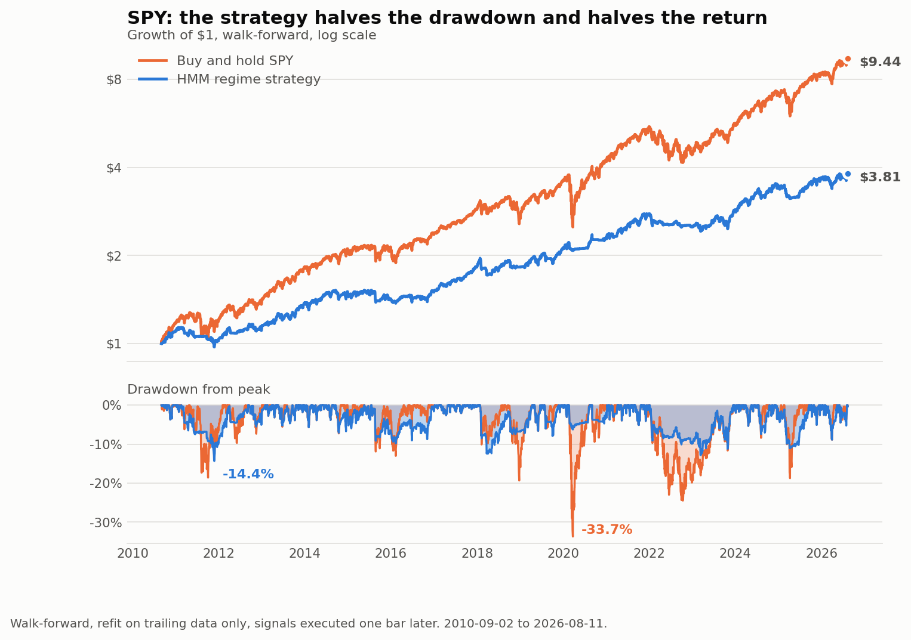
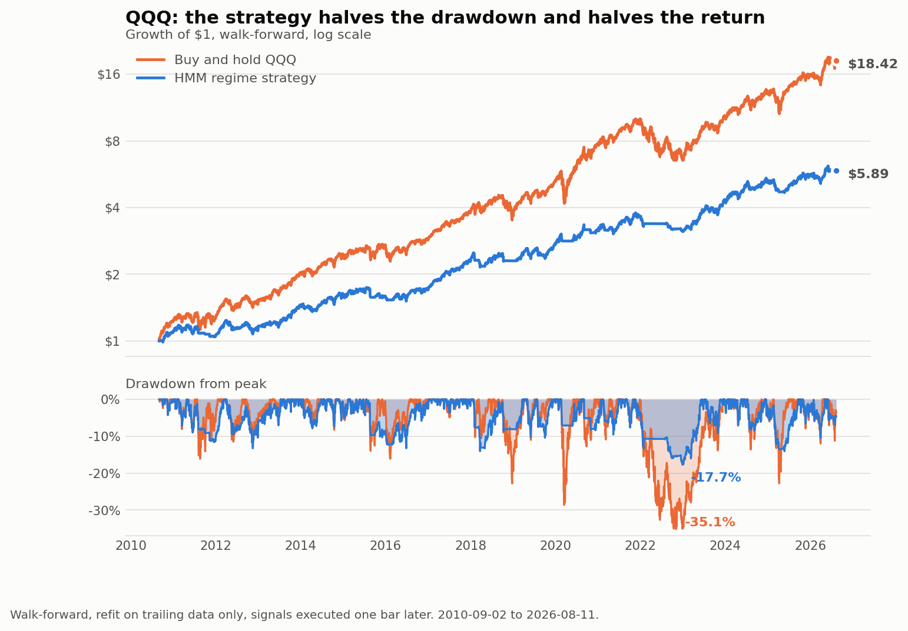

# stock-agent

Hidden Markov Model market-regime detection with a five-agent review process.

Forward algorithm for causal state probabilities, Viterbi for decoding,
Baum-Welch for training — following Jurafsky & Martin, *Speech and Language
Processing* (3rd ed.), [Appendix A](https://web.stanford.edu/~jurafsky/slp3/A.pdf).



**The blue line is the strategy. The orange line is doing nothing.** That is the
result, and the rest of this README is the honest accounting of it.

---

## Read this first: what the backtest actually found

The system is built and it works. Run honestly — walk-forward, refit on trailing
data only, filtered posteriors, signals executed one bar later — it **loses to
buy-and-hold on both symbols tested**, 2010–2026:

```
                      SPY                    QQQ
              Strategy  Benchmark    Strategy  Benchmark
CAGR             7.79%     15.39%      11.46%     20.35%
Volatility       9.18%     16.98%      11.71%     20.65%
Sharpe            0.86       0.93        0.98       1.00
Max drawdown   -13.72%    -33.72%     -15.75%    -35.12%
```

The pattern is consistent across both: **drawdown is roughly halved, return is
roughly halved, and risk-adjusted return is a wash or slightly worse.** The
strategy is in the market 92% of the time at 67% average exposure, so it is not
avoiding much — it is just permanently under-invested.

The same shape holds on QQQ:



### Reproduced 2026-08-21

Re-run from a clean checkout on the current code and a refreshed price file:

```
python -m stockagent backtest SPY --trials 20 --csv out_spy.csv
python -m stockagent backtest QQQ --trials 20 --csv out_qqq.csv
```

```
                      SPY                    QQQ
              Strategy  Benchmark    Strategy  Benchmark
CAGR             8.77%     15.16%      11.79%     20.10%
Volatility       9.76%     16.96%      12.23%     20.64%
Sharpe            0.91       0.92        0.97       0.99
Max drawdown   -14.35%    -33.72%     -17.71%    -35.12%
Avg exposure     71.4%                   70.3%
Refits              64                      64
```

These differ from the figures recorded above by a few tenths of a point. The run
is seeded (`random_state` in `config.py`), so the drift is from the price file
being refreshed, not from the model — but it is left visible rather than
overwritten, because a backtest whose numbers quietly change is worth less than
one whose numbers are dated. **The conclusion does not move: both symbols still
lose to buy-and-hold, and the deflated Sharpe still says so.**

| Question | SPY | QQQ |
| --- | --- | --- |
| Better than zero? | 100% — yes | 100% — yes |
| Better than the best of 20 worthless strategies? | 95.5% — yes | 97.3% — yes |
| Better than buy-and-hold? | **48.9% — no** | **47.2% — no** |

### Why: the labels predict volatility, not returns

The regime-conditional tables show the benchmark's own forward returns, grouped
by the regime being signalled at the time.

| SPY | Share | Fwd return | Fwd vol |  | QQQ | Share | Fwd return | Fwd vol |
|---|---|---|---|---|---|---|---|---|
| HighVolatility | 6.4% | **+39.7%** | 38.7% |  | Recovery | 12.2% | +40.2% | 21.7% |
| Recovery | 3.4% | +37.2% | 20.3% |  | Sideways | 6.4% | +33.6% | 19.2% |
| Bear | 10.1% | +22.4% | 21.2% |  | Bull | 63.8% | +22.1% | 14.2% |
| Bull | 59.0% | +15.1% | 10.7% |  | Bear | 11.7% | +5.1% | 35.7% |
| Sideways | 21.1% | +3.8% | 17.5% |  | HighVolatility | 5.8% | **−19.4%** | 34.2% |

Read the **volatility** columns first. They are ordered correctly on both
symbols: bars labelled `Bull` realised 10.7% / 14.2% volatility, bars labelled
`HighVolatility` realised 38.7% / 34.2%. The model found 100% of March 2020 and
76 of 85 GFC autumn bars. **Volatility-regime detection is genuinely working.**

Now read the **return** columns, and note that they disagree with each other.
On SPY, `HighVolatility` was the single *best* forward-return bucket (+39.7%);
on QQQ it was the worst by a wide margin (−19.4%). Same model, same features,
same period, opposite sign.

That instability is the finding. High-volatility periods contain the violent
rallies as well as the crashes, and which one dominates depends on the sample.
A relationship that flips sign between two indices this correlated is not
something to bet an account on.

> **This HMM is a volatility-regime detector, not a return predictor.** Using it
> to switch exposure on and off costs ~8%/yr.

### Correction: the sizing use is not supported either

An earlier version of this section concluded "use it to *size* positions, since
the volatility ranking holds up." Two further tests killed that claim, and it is
corrected here rather than quietly edited out.

**Volatility-matched.** A strategy that simply takes less risk can be replicated
by holding less of the index, so the honest comparison levers it back to the
benchmark's volatility:

| | Strategy Sharpe | Benchmark Sharpe | Levered return | Benchmark | Verdict |
|---|---|---|---|---|---|
| SPY | 0.86 | 0.93 | 14.60%/yr | 15.39%/yr | loses by 0.79% |
| QQQ | 0.98 | 1.00 | 20.24%/yr | 20.35%/yr | loses by 0.11% |

The halved drawdown was not free risk reduction. It was just less exposure.

**Against a naive baseline.** Detecting volatility regimes accurately is not the
same as *forecasting volatility better than something trivial*. Compared with
plain trailing 20-day standard deviation, out of sample:

| | HMM forecast error | Trailing-20d error | Result |
|---|---|---|---|
| SPY | 0.0702 | 0.0647 | HMM **8.6% worse** |
| QQQ | 0.0761 | 0.0738 | HMM **3.1% worse** |

A five-state hidden Markov model with 12 Baum-Welch restarts is beaten by one
line of pandas. The COVID and GFC detection was real, but "real" and "better
than the obvious baseline" are different claims, and only the second one
justifies the complexity.

### The subtlest version of the result

Running the deflated Sharpe on the walk-forward output produces a genuinely
interesting split:

| Question | Answer |
|---|---|
| Is the Sharpe better than zero? | 100.0% — yes |
| Better than the best of 20 worthless strategies (0.48)? | **95.5% — yes** |
| Better than buy-and-hold (Sharpe 0.92)? | **48.4% — no** |

So the signal is *real*. It is not noise, and it survives an honest correction
for having searched. It is simply **worse than the thing it was trying to
beat** — Sharpe 0.91 against the index's 0.92, while giving up 6.38%/yr of raw
return.

"Has a measurable edge over cash" and "is worth trading instead of an index
fund" are different claims, and only the second one should move money. A
significance test pointed at zero will happily bless a strategy that loses to
doing nothing, which is why `assess_sharpe` takes `benchmark_sharpe_annual` and
tests against whichever bar is harder.

**So the signal does not work — for timing or for sizing.** What is worth
keeping is the apparatus around it: walk-forward with no lookahead, forced
comparison against a naive baseline, deflation for multiple testing, enforced
risk limits, and an audit trail. That is a rig for testing ideas, and it is the
part most people never build. Point it at the next idea rather than tuning this
one on the same data.

Reproduce with `python -m stockagent backtest SPY`.

---

## Install and run

```bash
pip install -e .
```

That installs the package and the `stockagent` command. Then download price
history into `data/` — the four defaults, or the whole S&P 500:

```bash
python scripts/fetch_data.py
```

```bash
python scripts/fetch_data.py --sp500 --skip-existing
```

**Use `--sp500`.** Breadth is the one lever a small systematic strategy actually
controls. Grinold's fundamental law says information ratio scales as
`IC × √breadth` — skill times the square root of the number of independent bets.
Skill you cannot will upward; breadth you can. A four-symbol universe caps your
return no matter how good the signal is:

| IC (skill) | Breadth | Excess return |
|---|---|---|
| 0.05 | 12 | 2.6% |
| 0.05 | 50 | 5.3% |
| 0.05 | 250 | 11.9% |

502 names takes about ten minutes to download and makes the Discovery agent's
ranking mean something.

See your real balance and exactly which instruments it can take a position in:

```bash
stockagent account
```

Sizing is the binding constraint on a small account, and **fractional sizing is
on by default** because of it. At $217.73 equity the 1% risk budget is $2.18,
while one SPY share risks $17.75 at a 2×ATR stop — whole-share sizing refuses
SPY, QQQ, INTC and BTC outright and allows only BAC, ERIC, F, PFE, SOFI and T.
Fractionally, every symbol sizes to exactly 1.00% risk (0.12263 SPY, $94.82 of
stock, $2.18 at risk).

Quantities round *down* to the broker's precision. Rounding up would breach the
risk cap by a hair on every single trade, and a cap that is always slightly
breached is not a cap. Set `risk.allow_fractional_shares = false` if your broker
requires whole shares.

Current regime, with the fitted state table and any model warnings:

```bash
stockagent regime SPY --history 10
```

Run the five-agent debate and write an audit record:

```bash
stockagent analyze SPY --equity 10000
```

Walk-forward backtest — this is the one that tells you whether to believe any
of it:

```bash
stockagent backtest SPY --trials 20
```

**Always pass `--trials`.** A backtest reports the strategy you kept, not the
ones you discarded. If you tried twenty variations — state counts, feature sets,
thresholds — the winner's Sharpe is inflated by the search alone, and the best
of twenty *worthless* strategies still looks good. `--trials` deflates the
Sharpe accordingly (Bailey & López de Prado); see
[significance.py](src/stockagent/significance.py). Under-reporting the number is
how people fool themselves.

Inspect the model directly (transition matrix, stationary distribution, fit
diagnostics):

```bash
stockagent states SPY --save artifacts/spy_hmm.pkl
```

Rank the universe:

```bash
stockagent scan --top 10
```

Exit codes: `0` the Manager approved, `2` rejected or hold (the common
outcome), `1` an error.

Without installing, prefix commands with `PYTHONPATH=src` (`$env:PYTHONPATH="src"`
on PowerShell) and use `python -m stockagent` instead.

Tests:

```bash
python -m pytest tests -q
```

57 tests. The ones that matter verify that Forward and Viterbi agree with
`hmmlearn` to 1e-12, and that every indicator is causal.

---

## The HMM

| Problem | Algorithm | Method | Appendix |
|---|---|---|---|
| Likelihood | Forward | `RegimeHMM.filter` | A.3 |
| Decoding | Viterbi | `RegimeHMM.viterbi` | A.4 |
| Learning | Forward-Backward (Baum-Welch) | `RegimeHMM.fit` | A.5 |

Training is delegated to `hmmlearn`'s `GaussianHMM.fit`, which is Baum-Welch.
The Forward, Backward and Viterbi recursions are implemented directly in log
space, for two reasons.

**No lookahead.** `hmmlearn.predict_proba` returns *smoothed* posteriors
`P(q_t | o_1..o_T)` — they use the whole series, including bars after *t*. As a
trading signal that is lookahead bias, and it is the easiest way to produce a
backtest that looks brilliant and loses money live. `filter()` returns
*filtered* posteriors `P(q_t | o_1..o_t)`. `smooth()` exists for research and is
documented so it cannot be reached for by accident.

**Checkability.** `tests/test_hmm.py` verifies our Viterbi path is identical to
`hmmlearn`'s and our forward log-likelihood matches to 1.8e-12.

### Observation vector

Three channels: **daily return, volume, volatility**.

```
ret       log(close_t / close_{t-1})
log_vol   log of 21-day realised volatility, annualised
volume_z  63-day trailing z-score of log volume
```

Volatility is logged because it is bounded below by zero with a long right tail,
and a Gaussian emission fitted to raw volatility spends density on impossible
negative values. Volume is z-scored against a *trailing* window because share
volume trends with liquidity over 20 years.

The scaler is fitted on the training window only. Standardising over the full
sample would leak the future into every historical bar.

### Naming the states

Baum-Welch returns states numbered 0..K-1 with no meaning. Matching them to
regimes uses archetypes **scaled to the instrument's own baseline volatility**,
with absolute gates on what a label is allowed to mean. For an index-like
16.7%-volatility instrument the anchors work out to:

| Regime | Return | Volatility |
|---|---|---|
| Bull | +15%/yr | 12% |
| Bear | −20%/yr | 24% |
| Sideways | 0%/yr | 13% |
| Recovery | +22%/yr | 26% |
| HighVolatility | −5%/yr | 34% |

Fixed anchors mislabel individual stocks. Run on ERIC, the model finds a state
at −59.5%/yr and 71.2% volatility; against SPY-calibrated anchors it sat 5.2
units from *every* archetype and came out as an unrecognised HighVolatility.
Scaled to ERIC's own baseline it lands on **Bear at distance 1.16** — which is
plainly what it is. A −20%/yr state at 24% volatility and a −60%/yr state at
71% have almost the same Sharpe; they are one regime seen through instruments
of different amplitude. SPY's labels are unchanged by the rescaling.

Two things do **not** rescale, enforced as gates before any distance is
measured:

- **Bear requires actually losing money** (return below +2%/yr). A profitable
  state is never a bear market, however poorly it compares with its peers.
- **Recovery and HighVolatility require absolutely high volatility** (above
  both the instrument's baseline and an 18% floor). A sleepy instrument's
  choppiest state is not a crash.

An earlier version solved a one-to-one assignment in cross-state z-score space.
On real data it labelled a state returning **+0.4%/yr** as `Bear`, purely
because it was the least bullish of five and the bijection demanded that
something be called Bear. Two changes fixed it: absolute units, so "Bear" means
actually losing money; and independent nearest-archetype matching, so labels may
repeat and archetypes may go unused.

The consequence is that a long bull sample legitimately produces three shades of
Bull and no Bear — and `RegimeMap.warnings()` says so:

> *no state resembles Bear. The training window contains no such regime, so this
> model cannot ever signal one — treat its silence about Bear as absence of
> evidence, not evidence of absence.*

`tests/test_indicators_and_labeling.py::test_bear_requires_actually_losing_money`
locks that regression down.

---

## The five agents

| # | Agent | Job |
|---|---|---|
| 1 | **Manager** | Reviews everything, demands evidence, approves or denies |
| 2 | **Regime** | HMM regime detection, and audits its own model |
| 3 | **Discovery** | Ranks the universe into a watchlist |
| 4 | **Risk** | Sizes positions, enforces limits, holds a veto |
| 5 | **Devil's Advocate** | Argues against everything, states falsification |

Process: agents 2–5 analyse **independently**, then compare, debate, and revise;
the Manager reviews and returns APPROVE / REJECT / REQUEST_REANALYSIS. Only
approved decisions become recommendations.

Independence in round 1 matters — if agents saw each other's work while forming
a first view they would anchor on whoever ran first, and the debate would
measure ordering rather than evidence.

A majority is explicitly **not sufficient**. The Manager holds final authority,
and Risk and Devil's Advocate each hold an independent veto. Unanimity at high
confidence is treated as a warning about the process, not a confirmation.

These agents are **deterministic and quantitative** — they compute statistics
and apply explicit rules. They are not LLM calls. The debate has to be
reproducible and auditable, and a backtest over 5,000 bars cannot make 25,000
model calls. `Agent` defines the interface an LLM-backed reasoner would
implement; `prompts/master_prompt.txt` is the prompt for that variant.

Example output (`analyze SPY`, real run):

```
SPY @ 2026-08-07 -> HOLD [REJECT]
  Manager: Unresolved disagreement: discovery, risk want to buy while
           devils_advocate want to avoid
  Confidence: 35%
    regime           hold     100%  Sideways at 100% posterior
    discovery        buy       81%  SPY ranks 1/3, score +0.410
    risk             buy       60%  5 shares, 0.89% of equity at risk
    devils_advocate  avoid     90%  3 objections (3 serious)
        - Baum-Welch restarts disagree by 444 nats. The fit is one of several
          very different local optima, so the regime map is not a stable object
```

---

## Risk

Fixed-fractional sizing. The stop comes first and size is derived from it:

```
risk_budget    = equity × 0.01
risk_per_share = |entry − stop|          # 2 × ATR(14)
shares         = floor(risk_budget / risk_per_share)
```

A wider stop buys fewer shares, so every position risks the same amount. Limits:
1% per trade, 6% total portfolio heat, 10 open positions, no leverage. Full
detail and a worked example in `strategy/risk-management.md`.

The heat cap is the one that matters. Ten positions each risking 1% is not a 1%
risk — in a correction, correlations converge toward 1 and they all stop out on
the same morning.

---

## Layout

```
stock-agent/
├── data/                    SPY, QQQ, VIX, BTC daily CSVs
├── knowledge/               Trading-Rules.md, Agent-Goals.md, HMM-Notes.md
├── strategy/                indicators.md, risk-management.md
├── prompts/                 master_prompt.txt
├── scripts/fetch_data.py    stdlib + requests only
├── orchestration/           n8n workflow
├── logs/                    stockagent.log, decisions.jsonl (audit trail)
├── tests/                   57 tests
└── src/stockagent/
    ├── config.py            every tunable, validated on construction
    ├── data_io.py           loading and validation
    ├── indicators.py        RSI, MACD, EMA, ATR, Bollinger, OBV — all causal
    ├── features.py          the three-channel observation vector
    ├── regime/
    │   ├── hmm_model.py     Forward / Viterbi / Baum-Welch
    │   └── labeling.py      absolute-anchor state naming
    ├── agents/              the five agents
    ├── debate.py            the seven-step consensus process
    ├── portfolio.py         sizing, stops, exposure
    ├── backtest.py          walk-forward, no lookahead
    └── cli.py
```

---

## Data

`scripts/fetch_data.py` pulls daily OHLCV from Yahoo Finance (no API key) and
writes `data/<SYMBOL>.csv`. It depends only on `requests` plus the standard
library, so a cold clone can populate `data/` before the scientific stack is
installed.

Adjusted closes are used for return calculations. Keeping raw closes would put
phantom −50% returns in the training data on every 2-for-1 split, and the HMM
would happily learn them as a crash regime.

MCP connectors (Alpha Vantage, Longbridge, FMP, Bigdata.com) are used for
*live* quotes, news and sector breadth, written into `data/live_snapshot.json`
and read by `ctx.live`. They are a poor fit for bulk history — a 20-year daily
series is megabytes of JSON per symbol.

---

## Limits

Stated plainly, because unlisted limitations are the ones that hurt.

- **The signal underperforms buy-and-hold.** See the top of this file.
- **Baum-Welch restart spread is large** — 444 nats on SPY. The fit is one of
  several very different local optima. The Devil's Advocate reports this as a
  serious finding because it is one.
- **Gaussian emissions have thin tails.** Real returns do not. Features are
  winsorised at ±5σ to stop one bar capturing an entire state, which helps the
  fit and understates tail risk.
- **Taxes and slippage beyond 5bps are not modelled.** Short-term gains are
  taxed as ordinary income, which can erase a thin edge entirely.
- **A stop is not a guarantee.** Overnight gaps and halts fill below it.
- **Nothing here places an order.** No brokerage connection exists in this
  repository. Execution is manual and human.

Not financial advice. Analysis is probabilistic. No outcome is guaranteed.
